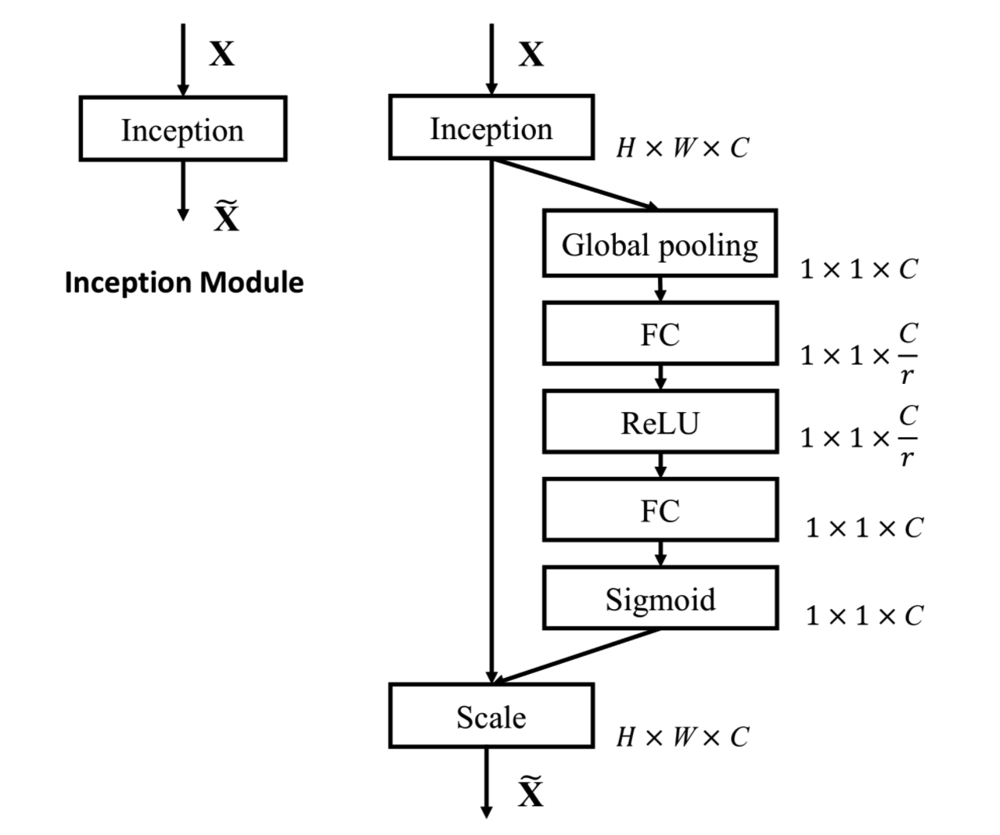

[toc]
### 1. Polarized Self-Attention: Towards High-quality Pixel-wise Regression

**Main idea:通道注意力+空间注意力**

Paper:https://arxiv.org/pdf/2107.00782.pdf

Code1:https://github.com/xmu-xiaoma666/External-Attention-pytorch/blob/master/attention/PolarizedSelfAttention.py

Code2:https://github.com/DeLightCMU/PSA   

### 2.Squeeze-and-Excitation Network(SELayer)

**main idea：通道注意力机制，对通道（channel）进行加权**

Paper:https://arxiv.org/pdf/1709.01507.pdf

Code:https://github.com/hujie-frank/SENet
### 4.Self-attention CV

from：https://zhuanlan.zhihu.com/p/283125663

### 12. CBAM: Convolutional Block Attention Module

**Main idea:通道注意力(双池化+MLP)+空间注意力**

Paper:https://arxiv.org/abs/1807.06521

Code1:https://github.com/luuuyi/CBAM.PyTorch/blob/master/model/resnet_cbam.py

